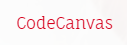

# CodeCanvas - T-Shirt Website for Programmers



Welcome to CodeCanvas - your one-stop destination for unique and stylish t-shirts designed for programmers! This project aims to provide programmers with a platform to express their coding passion through fashion. Whether you're a developer, coder, or tech enthusiast, CodeCanvas offers a range of high-quality t-shirts that resonate with your love for programming.

## Table of Contents
- [Introduction](#introduction)
- [Features](#features)
- [Installation](#installation)
- [Usage](#usage)
- [Technologies Used](#technologies-used)
- [Contributing](#contributing)

## Introduction

CodeCanvas is an e-commerce website tailored to programmers. Our goal is to create a seamless shopping experience for users who want to wear their coding passion proudly. With a user-friendly interface, a diverse collection of t-shirts, and secure online transactions, CodeCanvas is designed to cater to the needs of programmers while providing a visually appealing and functional platform.

## Features

- Browse a curated collection of programmer-themed t-shirts.
- View detailed product descriptions, images, and prices.
- Add items to your cart and adjust quantities.
- Securely make online payments through various payment gateways.
- Track your orders in real-time and receive updates.
- Leave reviews and ratings for purchased products.


## Installation

To get started with codeCanvas, follow these steps:

1. Make sure you have Node.js and npm installed on your machine.
2. Clone this repository: `git clone git@github.com:NimishaGajjar/final-project.git`
3. Navigate to the project directory: `cd final-project`
4. Install dependencies: `npm install`
5. Start the development server using `npm start`.
6. Open your web browser and visit `http://localhost:3000` to view the website.

### Setting Up the Backend Server (Using Strapi)

To power the backend of our codeCanvas website, we're using Strapi, an open-source headless CMS and API server. Follow these steps to set up the backend server:

1. **Sign Up for a Strapi Account:** If you don't have a Strapi account already, you'll need to sign up for one on the [Strapi website](https://strapi.io).

2. **Install and Configure Strapi:**

   ```bash
   # Install Strapi CLI globally
   npm install -g strapi

   # Create a new Strapi project
   strapi new codecanvas-backend

   # Navigate to your Strapi project directory
   cd codecanvas-backend
   
   # Start the Strapi server
   strapi start 


## Usage

- Browse through the collection of meme t-shirts, read descriptions, and view images.
- Add your favorite items to the shopping cart and adjust quantities.
- Proceed to checkout, choose your payment method, and place your order.
- Track the status of your order and receive updates on delivery.

## Technologies Used

- React.js for building the frontend interface.
- Redux and Toolkit for state management.
- Material-UI for styling and components.
- Stripe API for secure payment processing.
- Strapi for backend integration.

## Contributing

We welcome contributions from the community! If you'd like to contribute to codeCanvas, please follow these steps:

1. Fork the repository.
2. Create a new branch for your feature or bug fix.
3. Make your changes and commit them.
4. Push the changes to your fork.
5. Create a pull request to the main repository.


Thank you for choosing codeCanvas! We hope you enjoy shopping for and wearing our unique meme t-shirts tailored for programmers. If you have any questions or feedback, feel free to contact us at nimishagajjar57@gmail.com. Happy coding and happy shopping!

